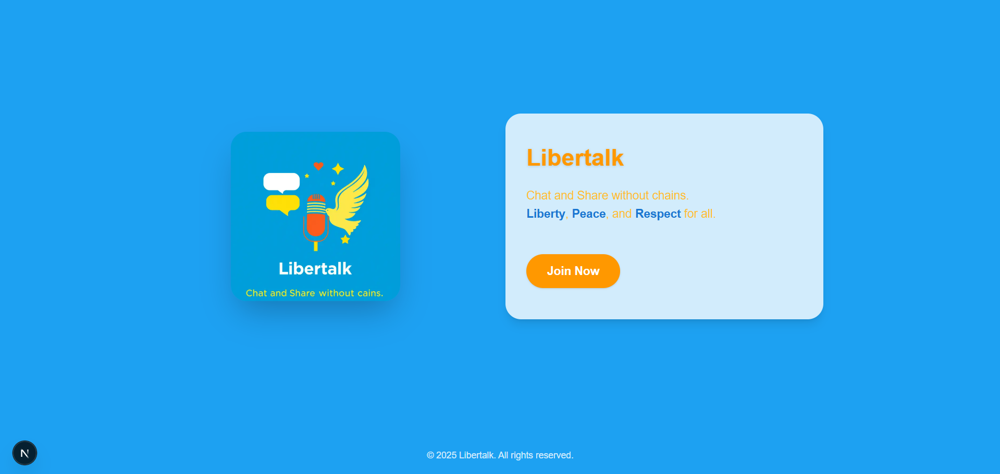
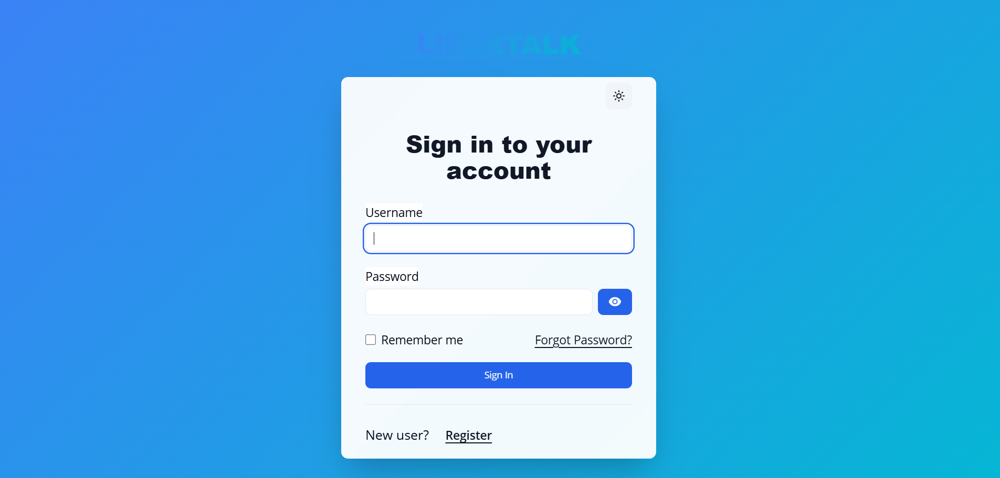
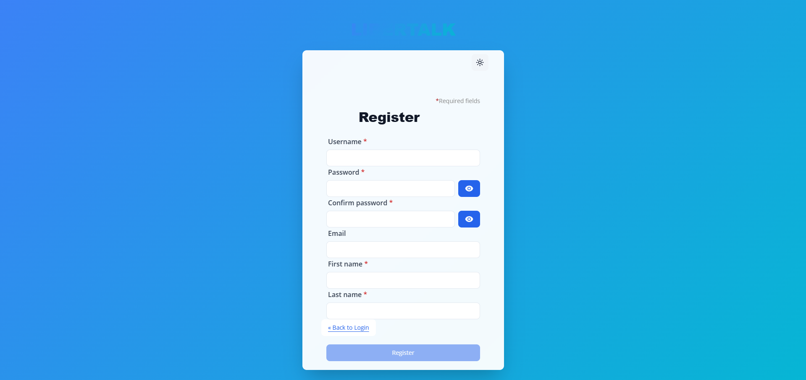
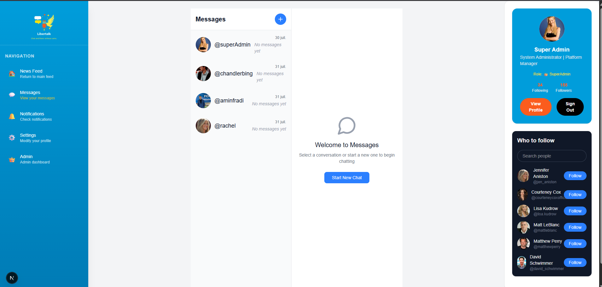

# Social Media Platform - Frontend

## Modern Social Networking Application

A full-featured social media platform with real-time messaging, content sharing, and user engagement features. Built with Next.js 15, React 18, and Tailwind CSS, secured with Keycloak authentication.



## 📸 Screenshots

### News Feed

### User SignIN/SignUP with Keycloakify 



### User Profile


### User Profile


## ✨ Key Features

- **User Authentication**: Secure login via Keycloak with OAuth2/OIDC, PKCE, and silent SSO
- **Real-Time Messaging**: WebSocket-powered chat with:
  - One-to-one conversations
  - Optimistic UI message delivery
  - Error handling with user notifications
  - Conversation history persistence
- **Content Management**:
  - Post creation/editing/deletion
  - Comments and reactions
- **User Engagement**:
  - User profile customization
- **Modern UI**:
  - Responsive Tailwind CSS design
  - Role-based interfaces (user/admin)
- **Intuitive Navigation**:
  - Mobile-friendly bottom navigation bar
  - Desktop sidebar navigation
  - Admin dashboard access for super users

## 🏗️ Architecture

This frontend application follows a modern, scalable architecture:

- **Framework**: Next.js 15 with App Router for optimal performance
- **State Management**: React Context API for global state, component-level state for local data
- **Styling**: Tailwind CSS for utility-first styling with custom theme configuration
- **Authentication**: Keycloak integration with secure token handling
- **Real-time Communication**: WebSocket for instant messaging updates
- **API Integration**: RESTful services with automatic error handling and retry logic

## 🚀 Getting Started

1. **Install dependencies**:
```bash
npm install
# or
yarn install
```

2. **Configure environment**:

```env
NEXT_PUBLIC_API_URL=http://localhost:8080
KEYCLOAK_URL=http://localhost:8081
KEYCLOAK_REALM=social-media
KEYCLOAK_CLIENT_ID=frontend-app
```

3. **Run development server**:
```bash
npm run dev
# or
yarn dev
```

4. **Open in browser**:
http://localhost:3000

## 🧩 Project Structure

```
src/
├── components/          # Feature-based components
│   ├── auth/            # Authentication flows
│   ├── posts/           # Post management
│   │   └── comments/    # Comment system
│   ├── profile/         # User profiles
│   ├── chat/            # Real-time messaging
│   ├── notifications/   # Notification system
│   ├── nav/             # Navigation components
│   ├── layouts/         # Page layouts
│   ├── sidebar/         # global sidebar
│   └── ui/              # Reusable UI elements
├── services/            # API service layer
│   └── auth/            # Authentication services
├── contexts/            # Application contexts
├── hooks/               # Custom React hooks
├── store/               # Redux Store
├── styles/              # Global styles
└── utils/               # Utility functions
```

## 🔧 Development Practices

- **Modular Architecture**: Feature-based component organization
- **State Management**: Context API for shared state
- **API Layer**: Centralized service classes for backend communication
- **Security**: JWT authentication for all API requests
- **Performance**: Code splitting, memoization, and lazy loading
- **Responsive Design**: Mobile-first approach with Tailwind CSS

## 🌐 API Integration

The frontend integrates with a Spring Boot backend providing:

- REST API endpoints for all social operations
- WebSocket support for real-time messaging
- Swagger documentation at `/swagger-ui.html`

## 📚 Learning Resources

- [Next.js Documentation](https://nextjs.org/docs)
- [Tailwind CSS](https://tailwindcss.com/docs)
- [React](https://react.dev/)
- [Keycloak JS Adapter](https://www.keycloak.org/docs/latest/securing_apps/#_javascript_adapter)

## 🛡️ Security Features

- Keycloak authentication with PKCE
- JWT token management
- Role-based access control
- Secure API communication
- Input validation and sanitization
